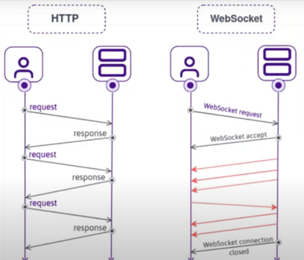

# Noom

Zoom Clone using NodeJS, WebRTC and Websockets.

서버셋업

>npm init -y  (터미널에서)

vscode 실행
packageJson 파일 수정


>npm i nodemon -D
>npm i @babel/core -D
>npm i @babel/cli -D 
>npm i @babel/node -D

>npm i @babel/preset-env -D
>npm i express  


        < HTTP/ WebSocket protocol 차이점 >

|HTTP                    |     WebSocket     |
|:--:|:--:|
|request 보내고 response 받으면 stateless 상태 | connection 상태 유지 됨|
|client 에서만 request 가능 | connection이 유지된 상태이기때문에 sever측에서도 request가능|
|real time <br>❌| real time<br> ✅|



websocket 사용법
1. npm i ws

    


# socket IO

https://socket.io/docs/v4/
프론트와 백엔드간에 실시간 통신을 가능케 하는 프레임워크

서버에 설치.
>npm i socket.io 
클라이언트에도 설치
>script(src="/socket.io/socket.io.js")

1. 서버측 : 커넥션을 받을 준비
```
wsServer.on("connection", (socket) => {  
    console.log(socket);
});
```

2. 클라이언트(브라우저)에서 socket 설치 후에는 io function 사용가능
```
const socket = io();
```
io 함수는 알아서 socket.io 를 실행하고 있는 서버를 찾는다.

3. 클라이언트 측 : 서버에 전송  
** 세번째 아규먼트에 오는 함수는 서버측에서 호출된다.**
```
  socket.emit("enter_room", { payload: input.value }, () => {
    console.log("server is done!");
  });
```
4: 서버측 : 10초후에 클라이언트측의 함수를 호출한다.
```
socket.on("enter_room", (msg, done) => {
    console.log(msg);
    setTimeout(() => {
      done();
    }, 10000);
  });
```

5. 서버측 :
```
socket.join(room name)
```

Adapter
서버들 사이에서 실시간으로 어플리케이션을 동기화 한다.

room id 가 sid에 존재하면 프라이빗용 room을 의미.
room id 가 sid에 존재하지 않으면  퍼블릭용 room을 의미.

https://socket.io/docs/v4/admin-ui/
npm i @socket.io/admin-ui